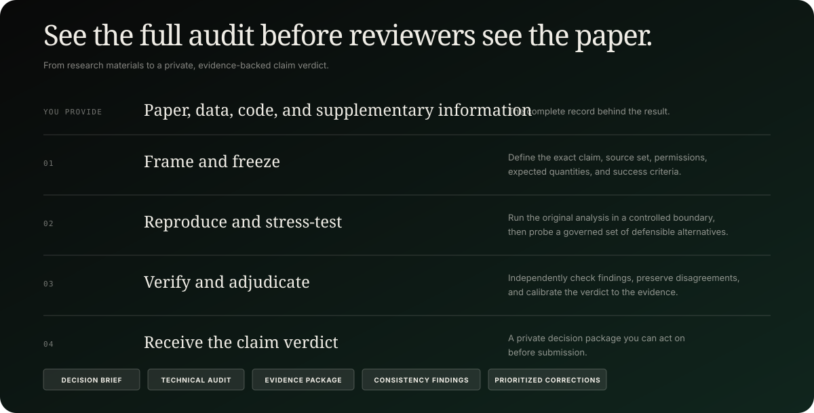

<p align="center">
  
</p>

<p align="center">
  <strong>Find the weakness in your paper before reviewers do.</strong>
</p>

<p align="center">
  <a href="https://peer2paper.com"><strong>peer2paper.com</strong></a> ·
  <a href="peer2paper/web/README.md">Web setup</a> ·
  <a href="peer2paper/examples/elite-party-cues/README.md">Case study</a> ·
  <a href="peer2paper/PUBLIC_RELEASE.md">Release policy</a> ·
  <a href="SECURITY.md">Security</a>
</p>

---

Peer2Paper is an open monorepo for independent, pre-submission scientific audits. Researchers provide a manuscript and its supporting data, code, and supplementary material; Peer2Paper frames the central claim, reproduces the original analysis, stress-tests defensible alternatives, independently verifies the findings, and delivers a private verdict package before peer review.

The project keeps one boundary deliberately sharp: reusable software, schemas, tests, and reviewed aggregate examples are public; submitted manuscripts, participant-level data, hidden answers, request-specific runs, and private verdict packages are not.

## What is included

| Area | Purpose |
|---|---|
| Public web app | Eight localized pre-submission, documentation, sample-result, authentication, and workspace experiences |
| Secure intake | Manuscript and research-material selection followed by authenticated, user-owned audit requests protected by Row Level Security |
| Scientific execution | A constrained runner with explicit manifests, runtime checks, timeouts, hashes, and attempt records |
| Validation boundary | A private score-only grader that keeps expected values outside routine-visible inputs and outputs |
| Audit workflow | Versioned routines for claim framing, reproduction, robustness testing, verification, adjudication, and delivery |
| Public examples | Authored aggregate case studies with explicit attribution, limitations, and publication boundaries |

<p align="center">
  
</p>

## Repository map

```text
.
├── .toone/                    # reusable organization and routine definitions
├── docs/assets/               # repository-native public artwork
├── peer2paper/
│   ├── web/                   # Next.js site and authenticated workspace
│   ├── execution/             # controlled scientific execution boundary
│   ├── grading/               # local score-only validation service
│   ├── config/                # versioned audit schemas and renderer
│   ├── examples/              # reviewed aggregate public case studies
│   └── validation/            # validation plans and runtime contracts
└── scripts/                   # monorepo release checks
```

Operational runs, assessment bundles, source cases, grader keys, and runtime state stay outside public Git. Read the [public-release policy](peer2paper/PUBLIC_RELEASE.md) before adding a fixture or changing repository visibility.

## Start the web application

Requirements: Node.js 22+, npm 10+, and—only for authentication and saved requests—a Supabase project.

```bash
cd peer2paper/web
npm ci
cp .env.example .env.local
npm run dev
```

The public site builds without Supabase credentials. Authentication and the workspace show a configuration state until the environment is connected. For Google OAuth, SMTP, redirect URLs, and the database migration, follow the [production setup guide](peer2paper/web/README.md).

Supported locales are English, Portuguese, Spanish, French, German, Italian, Dutch, and Russian.

## Deploy the public site

From the repository root, use the guarded release command:

```bash
./scripts/deploy-web-production
```

Do not invoke `vercel deploy` from `peer2paper/web`; the hosted project already uses that path as its Root Directory. The wrapper runs the complete web gate and deploys an isolated bundle with the directory layout Vercel expects.

## Verify the monorepo

Run the same checks used by CI from the repository root:

```bash
npm --prefix peer2paper/web ci
npm --prefix peer2paper/web run ci
python3 -m unittest discover -s peer2paper/execution/tests -p 'test_*.py'
python3 -m unittest discover -s peer2paper/grading/tests -p 'test_*.py'
node scripts/check-public-release.mjs
```

These commands cover type checking, linting, unit tests, locale contracts, the production build, runtime smoke checks, Python execution and grading tests, and the tracked-file plus reachable-history release scan.

## Read a result

The [elite party cues case study](peer2paper/examples/elite-party-cues/README.md) demonstrates the public result contract: source verification, reproduction status, a bounded robustness comparison, material limitations, and links to authoritative sources. It shows the evidence structure behind a verdict without publishing the submitted paper, participant rows, third-party analysis code, hidden benchmark key, or complete private audit record.

## Contributing and security

Contributions are welcome when they preserve the evidence and publication boundaries described above. Start with [CONTRIBUTING.md](CONTRIBUTING.md) and the [Code of Conduct](CODE_OF_CONDUCT.md).

Do not report vulnerabilities—or attach restricted research material—in a public issue. Follow [SECURITY.md](SECURITY.md) for private reporting and deployment responsibilities.

## Licence

Peer2Paper-authored software and documentation are available under the [MIT License](LICENSE). Linked papers, datasets, code repositories, trademarks, and other third-party materials retain their own terms and are not relicensed by this repository.
