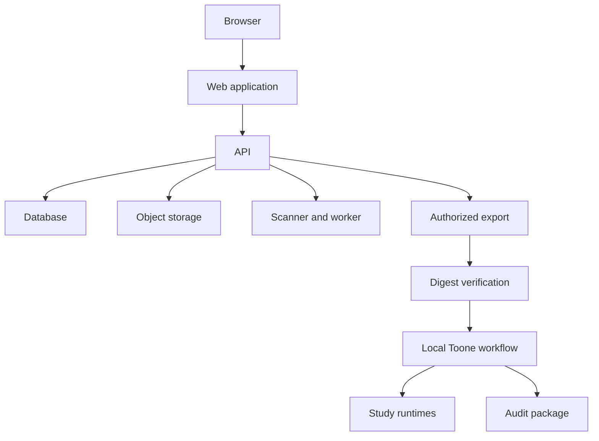

# ClaimBounty Architecture

> **Status**: In-Development | **Updated**: 2026-08-31 | **Scope**: Hosted intake and local scientific-audit boundary

ClaimBounty separates handling of private submissions from scientific execution. The hosted system owns identity, intake, administration, policy enforcement, storage, scanning, and authorized export. The local workflow owns case verification, reproduction, research, sensitivity analysis, independent verification, adjudication, and report assembly.

## Hosted ownership

- The OpenAPI contract defines the public HTTP seam.
- The API owns retention policy, authorization, upload validation, worker state, export assembly, and download digests.
- PostgreSQL stores application state; object storage holds source and export objects.
- The web application consumes generated contract types and does not decide server policy.

## Local ownership

- `workflow/claimbounty-scientific-audit/workflow.json` declares the parent and six child routines.
- `project://claimbounty/...` paths keep the package independent of a workstation path.
- The local runner records commands and artifacts without embedding organization configuration.
- Scientific claims remain pending until verification and adjudication finish.

## Trust boundary

An export crosses the hosted-to-local boundary only after authorization and whole-archive digest verification. The expected digest is obtained through a trusted response channel and checked before ZIP parsing or extraction. Private inputs and hidden evaluation material do not belong in the public repository.
